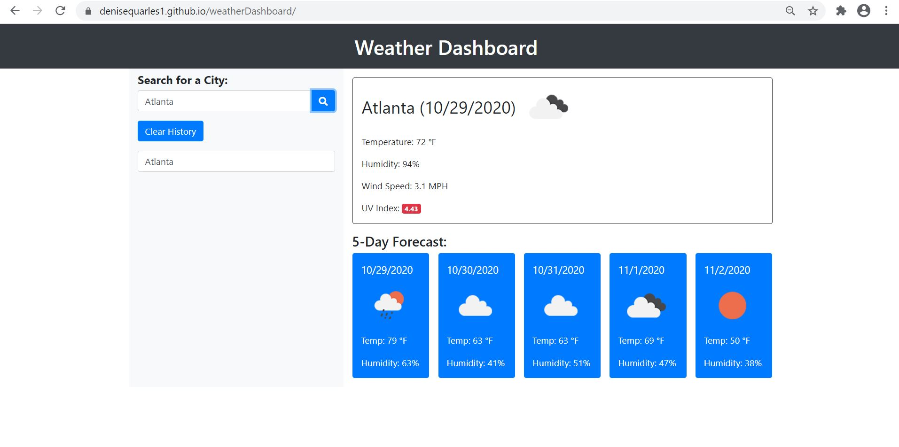

# weatherDashboard

## Table of Contents
* [Description](#description)
* [Installation](#installation)
* [Application](#application)
* [Credits](#credits)

## Description
This is a weather dashboard that will run in the browser and features dynamically updated HTML and CSS.  It uses the OpenWeather API to retrieve weather data for multiple cities in order to plan trips accordingly. It uses localStorage to store persistent data. It contains form inputs and when searching for a city, the user will be presented with current and future conditions for that city and that city is added to the search history.

    *  When viewing current weather conditions for a city, the user is presented with the city name, date, an icon representation of weather conditions, temperature, humidity, wind speed, and UV index.

    * When viewing the UV index, the user will be presented with a color that indicates whether the conditions are favorable, moderate, or severe.  

    * When viewing future weather conditions for that city, the user will be presented with a 5-day forecast that displays the date, an icon representation of weather conditions, the temperature, and the humidity.

    * When the user clicks on a city in the search history, presented with current and future conditions for that city.

    * When the weather dashboard loads, the user will be presented with the last searched city forecast.

 
  
 
 
## Installation
1. Access my GitHub repository using the following link: https://github.com/denisequarles1/weatherDashboard

2. Clone the repo by copying the key.

3. Use GitBash to enter the following: git clone [key]

4. The repository will then be copied onto your computer and you can run the index file to see the Horiseon website.

 

## Application
The deployed application can be found here: 

 

## Credits
W3Schools: https://www.w3schools.com/

Markup Validation Service: https://validator.w3.org/

